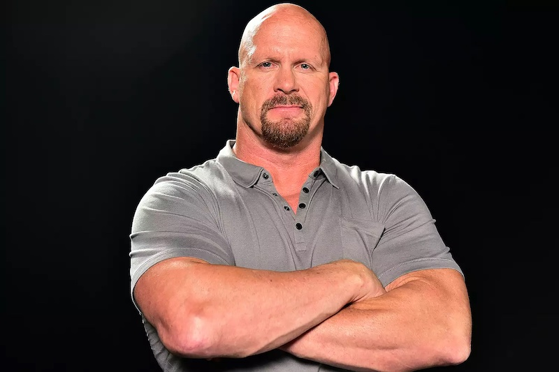

# Steve

Hello and welcome to Steve, a portfolio template built with plain HTML and CSS (and a line of JavaScript). This template focuses on simplicity and mobile responsiveness, with the styling left completely to you. I tried to keep the look as basic as possible (with a few exceptions).

Added [Font Awesome](https://fontawesome.com/) and [Reset CSS](https://meyerweb.com/eric/tools/css/reset/). The former is a popular icon toolkit used in many portfolio websites, while the latter is a personal preference. Feel free to remove them if you wish.

## How to run

Simply clone this repository to your machine and open **index.html**.

## QA

**What is the goal of this project?**

To give people who need a portfolio website a starting point.

**Why only HTML and CSS?**

To make the website as lightweight as possible.

**Why does it look so basic?**

To give users as much freedom to style it however they desire. I took a few liberties with certain elements (like projects and buttons), but of course feel free to change it however you want.

Here is a [working example with slight modifications](https://lemonstener.github.io/deyan-portfolio/)

**What are this template's strenghts?**

Mobile responsiveness that accounts for almost every screen and a simplistic UI with easy to use navigation that gives Hiring Managers and recruiters viewing it the smoothest possible experience. 

**Why Steve?**

Why not?

## Bottom line

This template is by no means perfect, so if you spot any bugs or any have general suggestions on how to improve it, let me know!